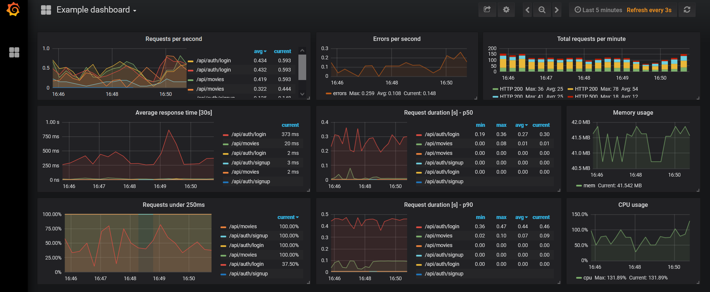

[](https://github.com/hessikaveh/microservice-scaffold/actions/workflows/main.yml)
# The scaffold for Flask based microservices with JWT authentications
We will create a docker ecosystem:
* One holding our flask app which has a couple of RESTful api endpoints  
* Second one to host the mongodb database 
* A docker image for Prometheus metrics
* And finally a Grafana docker image to show the activity and load
To run the docker images you need docker, then simply:
```bash
make build
make run 
```
# Grafana dashboard
The Grafana dashboard then can be found in the following address
```bash
http://localhost:3000/d/_eX4mpl3
```
